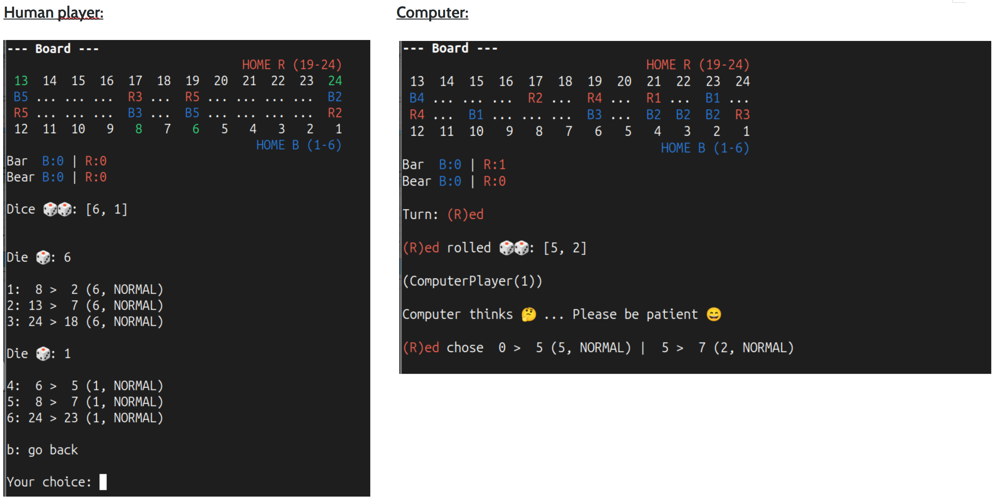

# 🎲🎲 Backgammon Engine & AI (Learning Project)

This repository contains a modular Backgammon engine written in Python, including move generation, rule enforcement, CLI gameplay, and multiple player types (human, random, heuristic, and rollout-based Computer Player).  

This is a learning and exploration project, focusing on clean architecture and game logic, and serving as a foundation for future AI experiments.

> ⚠️ **Note:** This is experimental. The game logic may contain bugs, and the engine might crash.  
> It is intentionally designed as a **transparent, extensible learning project** in collaboration with ChatGPT.

---

## ✨ Project Goals

- Implement a **complete Backgammon rules engine**
- Separate rules, state, move generation, and UI cleanly
- Explore **AI decision-making** under randomness (dice)
- Experiment with:
  - heuristic evaluation functions
  - rollout-based search
  - UCB1-based move selection
- Provide a playable **CLI interface**
- Provide an experimental **GNU Backgammon controller** for engine testing and serve as a foundation for future ML / NN experiments

---

## 🧩 Architecture Overview

This project is modularly structured to **separate the engine, rules, state management, move generation, CLI, and GNU Backgammon controller** clearly.  

### Core Modules

- **`core/`** – central game engine
  - `board.py` – board constants, fields, bar, and bear-off anchors
  - `state.py` – game state with undo / immutable-ish API
  - `rules.py` – rules: dice rolls, bar handling, bearing off, doubling cube
  - `generator.py` – generation of legal moves and turn moves
  - `engine.py` – game loop, events, cube management

- **`players/`** – player implementations
  - `player.py` – abstract player interface
  - `human.py` – interactive CLI player
  - `random.py` – baseline random player
  - `computer.py` – rollout- and heuristic-based AI
  - `valuation.py` – evaluation functions for heuristics

- **`cli/`** – terminal interface
  - `boardDisplay.py` - board rendering
  - `cliColors.py` - colored terminal 
  - `cliHumanInterface.py` - move navigation
  - `cliHandlers` - event handlers
  - `cliUtils` - helpers to clear screen and safe KeyBoardInterrupts
  - `game.py` - for playing the cli game

- **`gnubgCtrl/`** *(experimental)*  
  Contains the interface to GNU Backgammon for testing and data collection:
  - `parser.py` – extracts board state, dice, and moves
  - `resolver.py` – translates GNU moves into engine-compatible moves
  - `bot.py` – GnuBGBot, currently primarily for testing purposes
  - `controller.py` – **GnuBGController**: controls GNUBG via PTY, reads output, sends commands, synchronizes bot/engine 
  - **`logs/`** - log files to compare GNUBackgammon and engine

The code emphasizes **readability and separation of concerns** over raw performance.

---

## ⚡ Quickstart

### Notes & System Requirements

- Tested on **Ubuntu** (other operating systems may work but are not officially tested)
- **Python 3.8+** required
- A **Python virtual environment** (`venv`) is recommended for dependency isolation
- The project currently depends only on `numpy`, but additional dependencies may be added in future iterations
- **GNU Backgammon (`gnubg`) must be installed** to use the experimental GNUBG controller
- The bot is currently used primarily for **engine testing**; AI features may be tested later
- Two log files in the `logs/` folder allow verification and debugging of the workflow


### Setup (optional but recommended)

It is recommended to use a **Python virtual environment** to isolate dependencies:

```bash
python -m venv venv      # create virtual environment
source venv/bin/activate # Linux / macOS
venv\Scripts\activate    # Windows
```

After installation, you can activate the environment when working on the project and deactivate it when done:

```bash
deactivate
```

Dependencies can then be installed with:

```bash
pip install -r requirements.txt
```

### Navigate to the project folder

```bash
cd project_path/backgammon
```

### Start the CLI game

```bash
python -m cli.game
```

- Game modes: Human vs Human, Human vs Computer, Computer vs Computer
- Interactive move selection, colored board display

### Start the GNU Backgammon Controller (experimental)

```bash
python -m gnubgCtrl.controller
```

- Launches GNUBG in a pseudo-terminal
- Synchronizes engine moves, dice rolls, and doubling cube actions
- Generates logs for comparing engine vs. GNUBG

💡 Tip: Always use a virtual environment to avoid dependency issues.


---

## 🧠 Computer Decision Making (AI)

Backgammon is a **stochastic game** (dice rolls).  
The engine focuses on probabilistic and sampling-based approaches:

- **Basic Heuristic state evaluation**  
  - bear-off progress  
  - home board strength  
  - blots and blockades  
  - pip count penalties  
- **Random rollouts** to approximate future outcomes  
- **UCB1 (Upper Confidence Bound)** to balance exploration vs exploitation  
- Lightweight caching via Zobrist hashing (for fast state recognition)
- basic heuristic-based doubling cube decisions for computer players 

**State evaluation** could potentially be improved by parameter tuning against GNU Backgammon, or by supervised deep learning using a large database of games generated with GNUBG.

All techniques are intentionally **simple and educational** rather than optimized.

---

## 🖥️ CLI Gameplay


The game can be played entirely in the terminal:

- colored board rendering
- interactive move selection
- step-by-step or fast execution
- human vs computer (random), computer vs computer, or human vs human



---

## 🧪 Experimental: GNUController Interface

The **GnuBGController** is an **experimental interface to GNU Backgammon**, currently designed primarily for **engine testing and validation** and future AI Projects.

### Features

- Launches GNU Backgammon in a pseudo-terminal (PTY)  
- Continuously reads engine output  
- Detects prompts (game start, dice rolls, moves, doubling cube actions)  
- Sends commands (moves, dice, doubling decisions)  
- Optionally synchronizes a bot with engine move logic  
- Logging for later analysis and comparison with the engine  


### Known Limitations

- Not all move formats are reliably recognized, especially **bear-off moves**  
- Cases where the bot wins and GNUBG resigns may produce errors or incomplete termination  
- The interface is **experimental and not fully stable**  
- Primarily serves as a **testing tool** and **data source** for future AI experiments  

### Workflows

- **Interactive Testing**
  - Users enter moves manually, controller synchronizes engine and GNUBG
  - Logs allow verification of dice, board state, and moves  

- **Bot Testing**
  - Bot selects moves for the engine, controller sends them to GNUBG
  - Logs show engine vs. GNUBG consistency  


---

## 🤝 Contributing & Exploration

This is a **learning and experimental project**, and contributions or experiments are **welcome but optional**.  
You can:

- play around with the CLI interface  
- try adding new AI heuristics or evaluation functions  
- experiment with rollout depths, cube strategies, or other stochastic methods  
- test ideas for connecting to GNU Backgammon  
- explore ways to generate large game datasets for training  

> ⚠️ Note: This project is primarily educational. Expect incomplete features and experimental code.

---

## 📚 Learning Context

This project was created as a **personal learning project** with the support of **ChatGPT**.

ChatGPT was used as:

- a discussion partner for design decisions  
- help with refactoring, documentation, and type hints  
- guidance on AI concepts and architecture

All code was written, reviewed, and integrated **manually by the author**, with conceptual guidance and explanations provided by ChatGPT as a learning and development aid.

---

## 🚧 Current Limitations

- No neural network evaluation (yet)  
- No large-scale self-play training  
- Performance is not optimized  
- Not benchmarked against strong engines

These limitations are intentional to keep the project understandable and hackable.

---

## 🛣️ Possible Next Steps

- Connect reliably to GNU Backgammon for evaluation  
- Store large-scale game datasets efficiently  
- Replace heuristic evaluation with a neural network  
- Add supervised or reinforcement learning  
- Improve rollout policies

---

## 📄 License

MIT License

